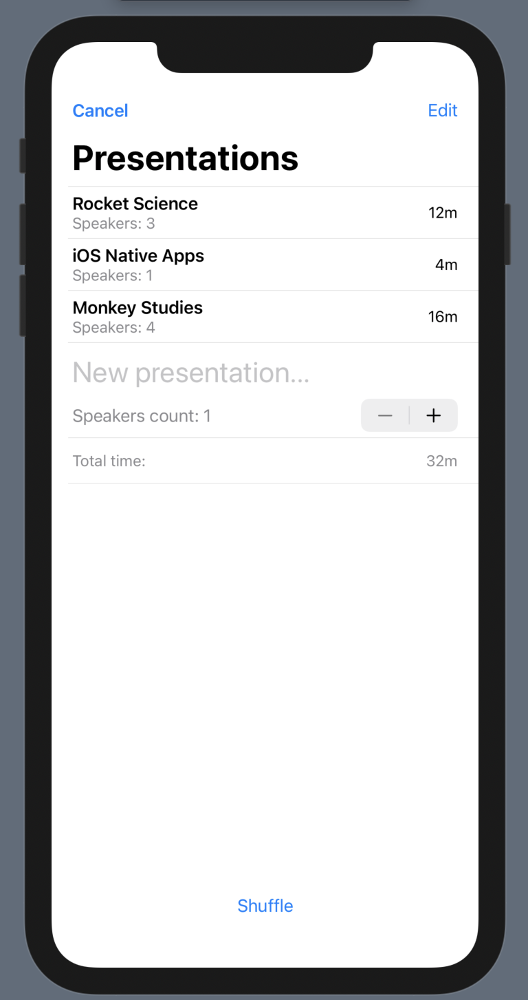

# Demo-Day-App
Learning SwiftUI by creating presentations organizer app 

## Story
In AR/VR lab we used to have demo days, where all developers present what they have done last sprint. Each team prepared presentation and showed it to other teams. 

This app helps to organize such demo days, calculate expected duration and randomize presentations order. Hope, you'll find it handy.
